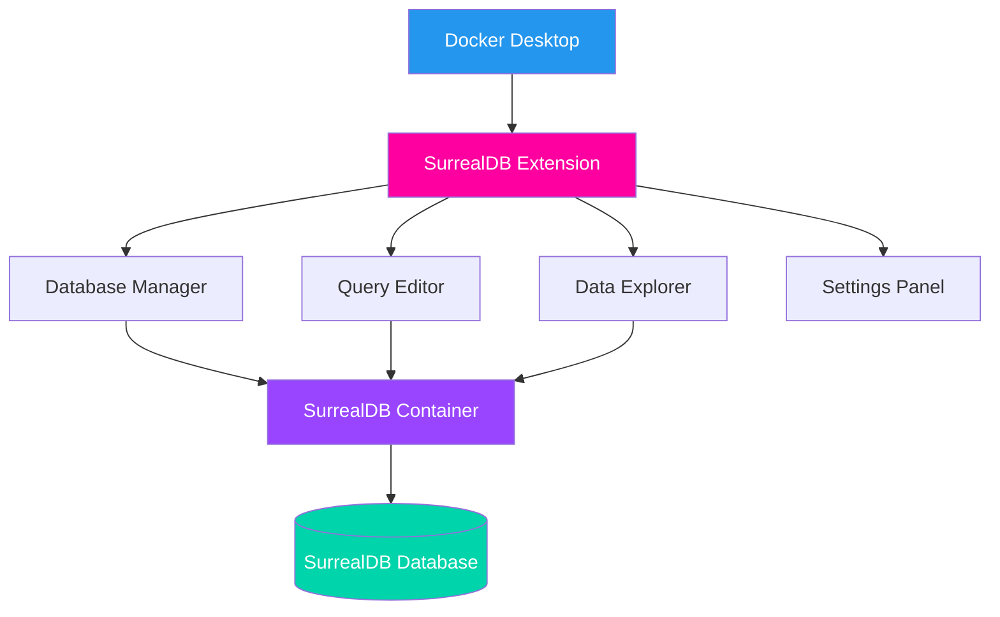
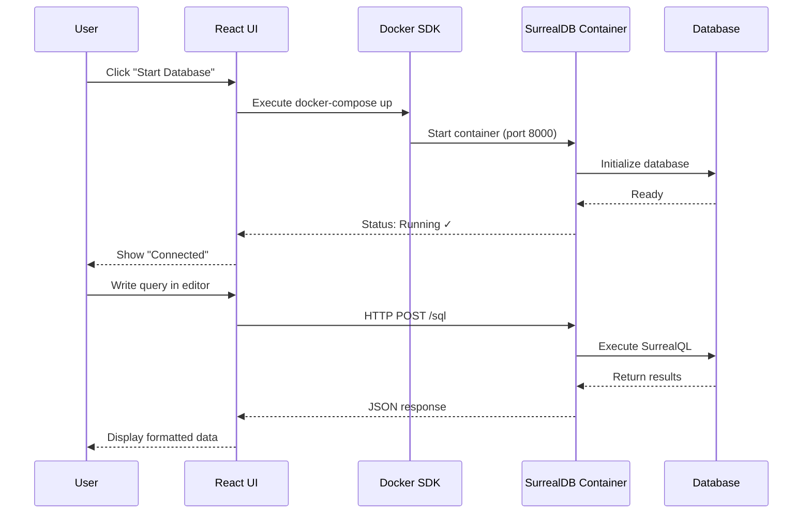
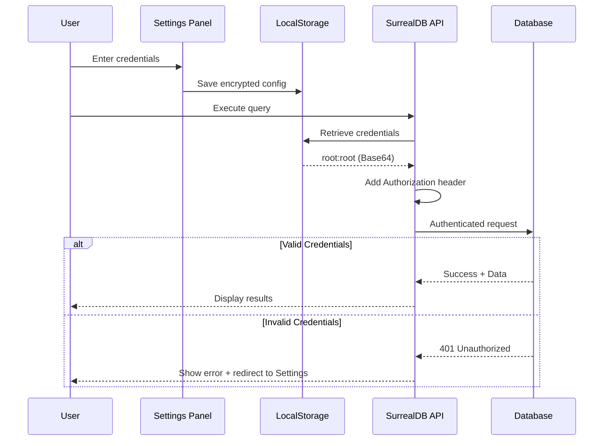

# SurrealDB Docker Extension

A Docker Desktop extension for managing SurrealDB databases with an intuitive UI.


## Features

- 🚀 **Easy Database Management**: Start, stop, and restart SurrealDB instances with one click
- 📝 **Query Editor**: Write and execute SurrealQL queries with syntax highlighting
- 🔍 **Data Explorer**: Browse tables and view data in a clean, organized interface
- ⚙️ **Configurable Settings**: Customize connection parameters and preferences
- 🎨 **Modern UI**: Built with Material-UI for a polished user experience

## Extension Architecture 


## Prerequisites

- Docker Desktop 4.55.0 or later
- Docker Engine 20.10.0 or later

## Installation

### From Docker Desktop Marketplace (Coming Soon)

1. Open Docker Desktop
2. Navigate to the Extensions marketplace
3. Search for "SurrealDB"
4. Click "Install"

### Manual Installation (Development)

1. Clone this repository:
   ```bash
   git clone https://github.com/ajeetraina777/surrealdb-docker-extension.git
   cd surrealdb-docker-extension
   ```

2. Build the extension:
   ```bash
   docker build -t ajeetraina777/surrealdb-docker-extension:1.0.0 .
   ```

3. Install the extension:
   ```bash
   docker extension install ajeetraina777/surrealdb-docker-extension:1.0.0
   ```

## Usage

### Starting SurrealDB

1. Open Docker Desktop
2. Navigate to the Extensions section
3. Click on "SurrealDB"
4. In the "Database Manager" tab, click "Start"
5. Wait for the database to initialize

### How the data flows :


### Running Queries

1. Switch to the "Query Editor" tab
2. Write your SurrealQL query in the editor
3. Click "Execute Query"
4. View results in the results panel

Example queries:
```sql
-- Create a new user
CREATE users SET name = "John Doe", age = 30, email = "john@example.com";

-- Select all users
SELECT * FROM users;

-- Update a user
UPDATE users SET age = 31 WHERE name = "John Doe";

-- Delete a user
DELETE users WHERE name = "John Doe";
```

### Exploring Data

1. Navigate to the "Data Explorer" tab
2. Select a table from the left sidebar
3. View table data in the main panel

### Configuring Settings

1. Go to the "Settings" tab
2. Modify connection parameters as needed
3. Click "Save Settings"



## Default Configuration

The extension uses the following default settings:

- **Host**: localhost
- **Port**: 8000
- **Username**: root
- **Password**: root
- **Namespace**: test
- **Database**: test

## Development

### Project Structure

```
surrealdb-docker-extension/
├── Dockerfile                 # Extension container definition
├── metadata.json             # Extension metadata
├── docker-compose.yaml       # SurrealDB service definition
├── surrealdb.svg            # Extension icon
├── ui/                      # Frontend React application
│   ├── src/
│   │   ├── components/      # React components
│   │   ├── App.tsx         # Main application component
│   │   └── main.tsx        # Application entry point
│   ├── package.json
│   ├── vite.config.ts
│   └── tsconfig.json
└── README.md
```

### Building the Extension

```bash
# Build the extension
docker build -t ajeetraina/surrealdb-docker-extension:1.0.0 .

# Install for testing
docker extension install ajeetraina/surrealdb-docker-extension:1.0.0

# Update the extension
docker extension update ajeetraina/surrealdb-docker-extension:1.0.0

# Remove the extension
docker extension rm ajeetraina/surrealdb-docker-extension:1.0.0
```

### Local Development

For UI development with hot reload:

```bash
cd ui
npm install
npm run dev
```

Then use the Docker Extension CLI to enable dev mode:

```bash
docker extension dev debug ajeetraina777/surrealdb-docker-extension:1.0.0
docker extension dev ui-source ajeetraina777/surrealdb-docker-extension:1.0.0 http://localhost:3000
```


